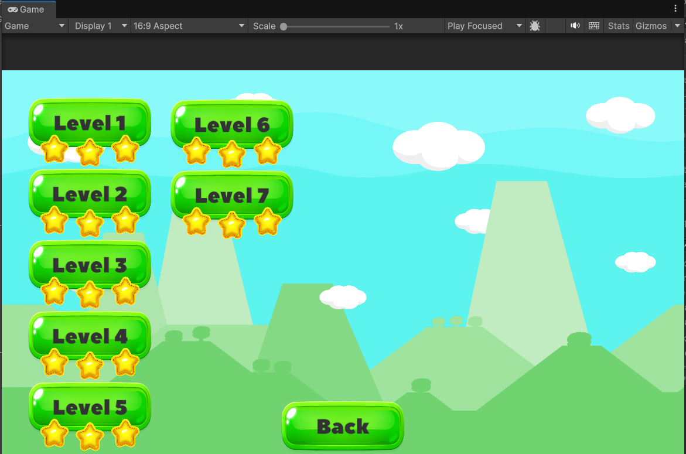
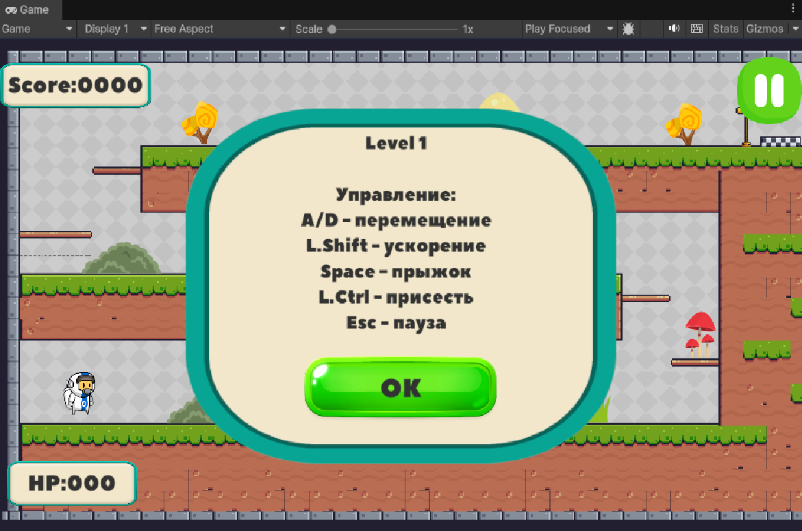
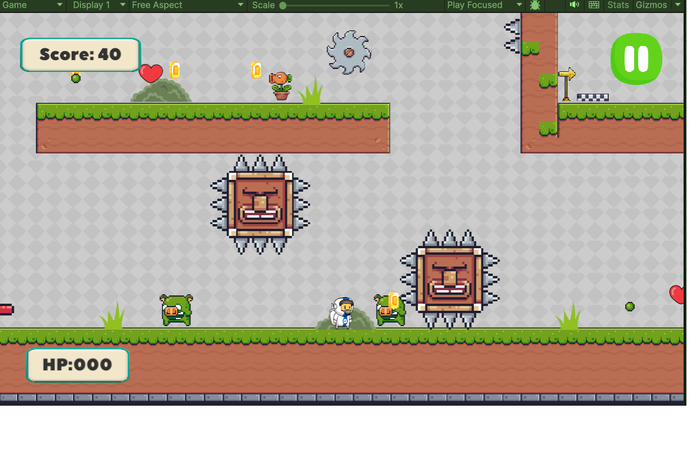

# Моя игра Leapbound

## Описание
«Пиксельный 2D‑платформер с механиками.
Игрок исследует загадочный мир, сражается с монстрами. Главная цель — пройти все уровни, набрав максимальное количество звёзд.
 
Создан за 2 месяца как индивидуальный проект».

## О проекте

**Жанр**: Платформер  
**Платформа**: Windows
**Движок**: Unity 6000.3.4f1 LTS  
**Язык**: C#  
**Сроки разработки**: октябрь -ноябрь 2025  

## Скриншоты  

## Особенности
- 6 уникальных уровней с возрастающей сложностью;
- Полная анимация движения игрока
- 2 врага с разной механикой;
- Двигающийся элементы игры с которыми можно взаимодействовать;
- Система подсчёта очков (PlayerScore)
- Управление аудио (AudioManager)
- Аптечки (HealthPickup)
- Сохранения данных и возможность перепроходить уровни для лучшего результата

### Ключевые системы

1. **Управление игроком**:
   - Обработка ввода через `Input.GetButtonDown("Jump")`.
   - Физика: `Rigidbody2D` .
2. **Анимации**:
    - Игрока;
    - Врагов;
     - Платформ, трамплина и статических обьектов 
3. **UI**:
   - Полоска здоровья, счёт, показатель звезд.

## Как запустить
1. Скачайте проект.
2. Откройте в Unity версии 6000.3.4f1 LTS.
3. Запустите сцену MainMenu.
